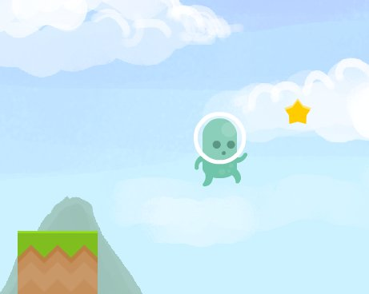
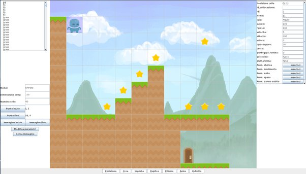
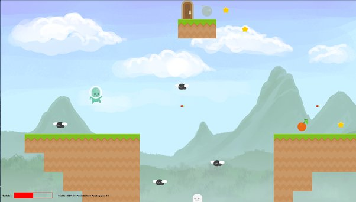
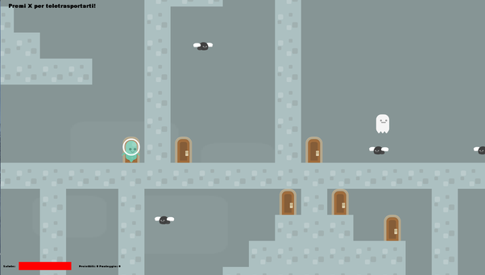
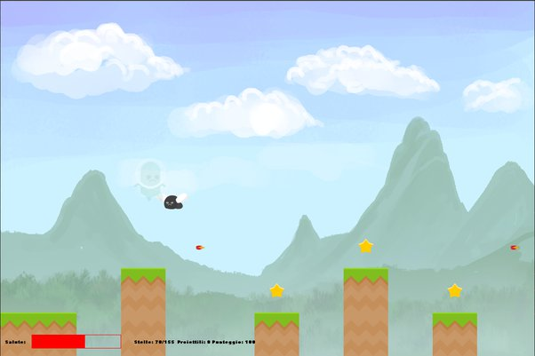

# :star: SRC :star:

By Davide Manco ([Doch88](https://github.com/Doch88)) and Luca Rossi ([luca-rossi](https://github.com/luca-rossi)).

## What is it?

SRC is a university project we developed for the Object-Oriented Programming course in 2017.  
We were young and motivated students, and we wanted to work on a challenging and fun project.  
At first, we considered developing yet another game, but then we realized that it would be too trivial. Since we are crazy and like to waste time, we decided to write something that could be used to develop games instead.

SRC is a 2D game editor and engine that uses only the Java standard library. You can create your platform games and then play them inside the same software.  
It supports basic animations, collisions, portals, simple NPCs, bullets and so on.

We have done this project during our bachelors years, and as such there are the following issues:
- We're Italians. It's not a problem per se, but when we wrote the code, all our comments and variables were in Italian instead of English. Such a bad decision.
- It uses a MySQL database. The project requirements were specific about using a MySQL database. Before committing to GitHub I managed to embed a MariaDB database (thanks to the MariaDB4J project) inside the software, removing the need of using a separate DBMS. But using such a database still carries some limitations.
- The code could be better. We were still bachelors students after all.

Before committing to GitHub, I also added localization in different languages.  
As mentioned, the project was fully in Italian, and while translating the code and comments required too much time and work, localizing the editor and the platform was a fairly easy job, allowing non-Italian users to try it.

## Editor mode

The Editor mode is the mode used to create new maps and sprites.  

It allows to create NPCs, walls and grounds, collectables and so on.  
You can use your own images for the sprites and the animation and define characteristics such as waypoints for the movements or health.

At the bottom, there are all the commands needed to move stuff, create new items, delete them etc.
It is also possible to test the map using the "Start" button.

## Platform mode

Once a game is created, it is possible to play it using the Platform mode, after creating a save entry.  
This mode starts from the first map of a game and unlocks the next ones when the player gets to the end of the map.
